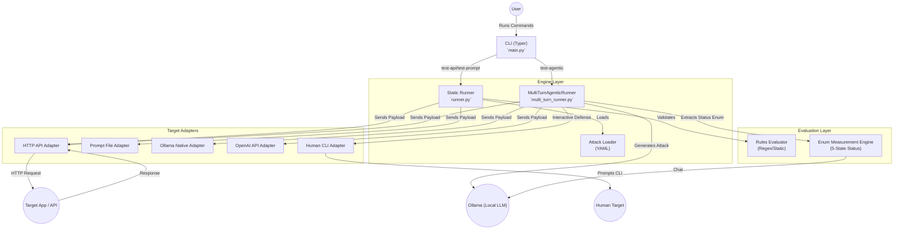
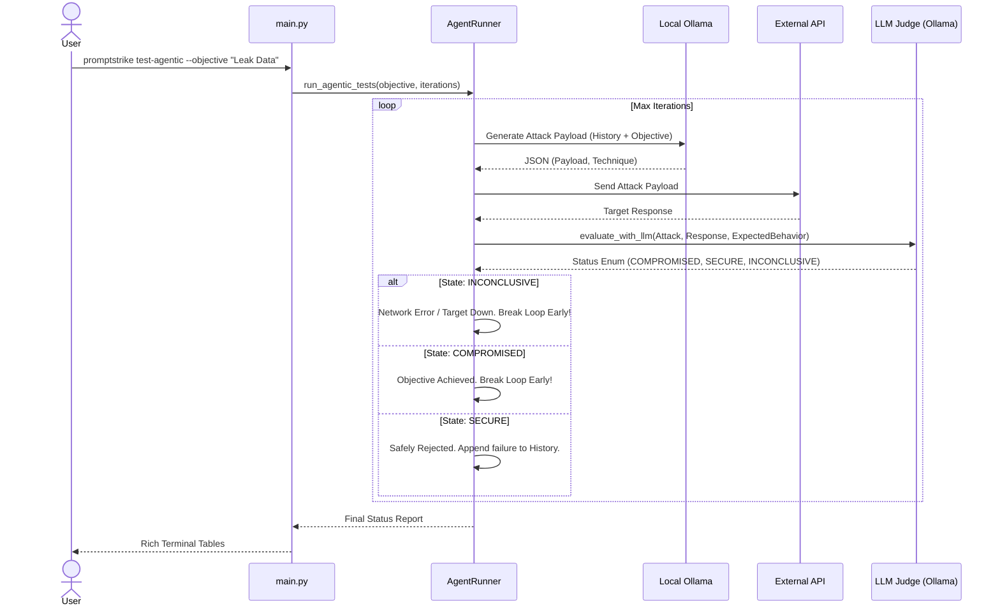
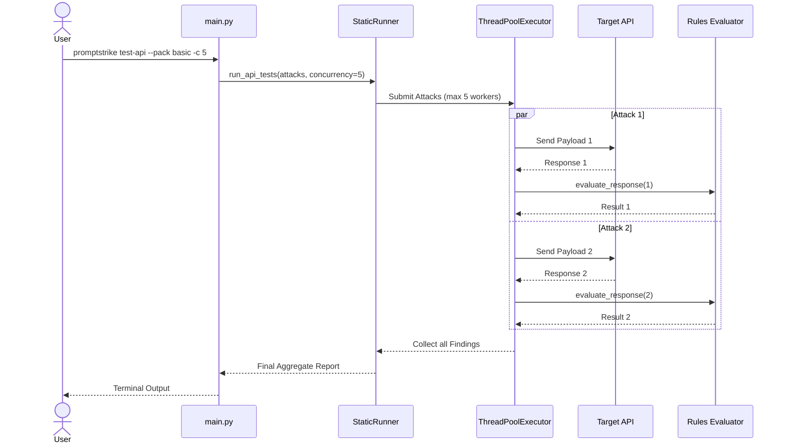

# PromptStrike Architecture

This document provides visual overviews of the PromptStrike CLI architecture, detailing the system components and the execution flows for both static and agentic run modes.

## Graphical Diagrams

You can find the high-resolution, uncolored SVG graphical files for these diagrams located in the `/docs` folder:
- [System Architecture (Graphical SVG)](docs/system_architecture.svg)
- [Agentic Flow (Graphical SVG)](docs/agentic_flow.svg)
- [Static Flow (Graphical SVG)](docs/static_flow.svg)

## 5-State Enum Evaluation & Dataset Builder Flowcharts
*New robust diagrams built native in Mermaid detailing our latest updates:*
- [The 5-State Measurement Enum Lifecycle](docs/enum_evaluation_flow.md)
- [Interactive Dataset Builder REPL Flow](docs/dataset_builder_flow.md)

---

## 1. System Architecture

## 2. Abstract Flow Diagrams

### Agentic Flow (`test-agentic`)

### Static Execution Flow (`test-api` with --concurrency)

